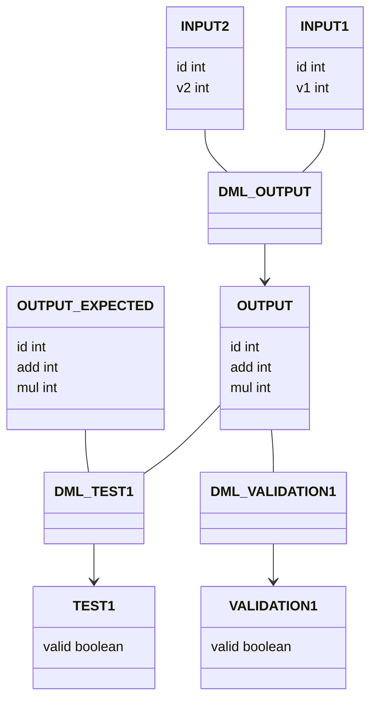

# Sample

## how to use

Install requirements before executing `main.py`.
```
pip install pyyaml attrdict
```

Execute `main.py` and get test queries as the following.
```sql
-- create datbases;
DROP DATABASE IF EXISTS sample_actual CASCADE;
DROP DATABASE IF EXISTS sample_expected CASCADE;
CREATE DATABASE sample_actual;
CREATE DATABASE sample_expected;
-- create tables;
SET hivevar:database=sample_actual;
CREATE TABLE ${database}.input1 (
  id int,
  v1 int
)
;
SET hivevar:database=sample_expected;
CREATE TABLE ${database}.input1 (
  id int,
  v1 int
)
;
SET hivevar:database=sample_actual;
CREATE TABLE ${database}.input2 (
  id int,
  v2 int
)
;
SET hivevar:database=sample_expected;
CREATE TABLE ${database}.input2 (
  id int,
  v2 int
)
;
SET hivevar:database=sample_actual;
CREATE TABLE ${database}.output (
  id int,
  add int,
  mul int
)
;
SET hivevar:database=sample_expected;
CREATE TABLE ${database}.output (
  id int,
  add int,
  mul int
)
;
SET hivevar:database=sample_actual;
CREATE TABLE ${database}.output_test1 (
  valid boolean
)
;
SET hivevar:database=sample_expected;
CREATE TABLE ${database}.output_test1 (
  valid boolean
)
;
SET hivevar:database=sample_actual;
CREATE TABLE ${database}.output_validation1 (
  valid boolean
)
;
SET hivevar:database=sample_expected;
CREATE TABLE ${database}.output_validation1 (
  valid boolean
)
;
-- insert testdata into the tables;
INSERT OVERWRITE TABLE sample_actual.input1 VALUES (1, 1), (2, 2);
INSERT OVERWRITE TABLE sample_actual.input2 VALUES (1, 2), (2, 3);
INSERT OVERWRITE TABLE sample_expected.output VALUES (1, 3, 2), (2, 5, 6);
-- execute dml;
SET hivevar:database=sample_actual;
SET hivevar:database_actual=sample_actual;
SET hivevar:database_expected=sample_expected;
INSERT OVERWRITE TABLE ${database}.output
SELECT
  t1.id AS id,
  v1 + v2 AS add,
  v1 * v2 AS mul
FROM
  ${database}.input1 t1 JOIN ${database}.input2 t2
  ON t1.id = t2.id
;
SET hivevar:database=sample_actual;
SET hivevar:database_actual=sample_actual;
SET hivevar:database_expected=sample_expected;
WITH t1 AS (
  SELECT COUNT(*) AS lines FROM ${database_actual}.output
), t2 AS (
  SELECT COUNT(*) AS lines FROM ${database_expected}.output
)
INSERT OVERWRITE TABLE ${database_actual}.output_test1
SELECT t1.lines = t2.lines AS valid FROM t1, t2
;
SET hivevar:database=sample_actual;
SET hivevar:database_actual=sample_actual;
SET hivevar:database_expected=sample_expected;
INSERT OVERWRITE TABLE ${database}.output_validation1
SELECT SUM(IF(add < 0, 1, 0)) = 0 AS valid
FROM ${database}.output
;
-- validate output;
!grep true /user/hive/warehouse/sample_actual.db/output_test1/000000_0;
!grep true /user/hive/warehouse/sample_actual.db/output_validation1/000000_0;
```

Execute these queries with hive. We can check validation outputs whether passing the test.

## example

I execute the above queries on the docker container as below.
```
$ docker run -it --rm vienai8d/hive-standalone
SLF4J: Class path contains multiple SLF4J bindings.
SLF4J: Found binding in [jar:file:/opt/hive-3.1.2/lib/log4j-slf4j-impl-2.10.0.jar!/org/slf4j/impl/StaticLoggerBinder.class]
SLF4J: Found binding in [jar:file:/opt/hadoop-3.3.0/share/hadoop/common/lib/slf4j-log4j12-1.7.25.jar!/org/slf4j/impl/StaticLoggerBinder.class]
SLF4J: See http://www.slf4j.org/codes.html#multiple_bindings for an explanation.
SLF4J: Actual binding is of type [org.apache.logging.slf4j.Log4jLoggerFactory]
Hive Session ID = f84ba221-5f4b-473a-80db-8328c5943ae1

Logging initialized using configuration in jar:file:/opt/hive-3.1.2/lib/hive-common-3.1.2.jar!/hive-log4j2.properties Async: true
Hive Session ID = ba42f973-503b-41ad-af05-ef7c7b548800
Hive-on-MR is deprecated in Hive 2 and may not be available in the future versions. Consider using a different execution engine (i.e. spark, tez) or using Hive 1.X releases.
hive> -- create datbases;
hive> DROP DATABASE IF EXISTS sample_actual CASCADE;
OK
Time taken: 0.478 seconds
hive> DROP DATABASE IF EXISTS sample_expected CASCADE;
OK
Time taken: 0.014 seconds
hive> CREATE DATABASE sample_actual;
OK
Time taken: 0.131 seconds
hive> CREATE DATABASE sample_expected;
OK
Time taken: 0.019 seconds
hive> -- create tables;
hive> SET hivevar:database=sample_actual;
hive> CREATE TABLE ${database}.input1 (
    >   id int,
    >   v1 int
    > )
    > ;
OK
Time taken: 0.699 seconds
hive> SET hivevar:database=sample_expected;
hive> CREATE TABLE ${database}.input1 (
    >   id int,
    >   v1 int
    > )
    > ;
OK
Time taken: 0.047 seconds
hive> SET hivevar:database=sample_actual;
hive> CREATE TABLE ${database}.input2 (
    >   id int,
    >   v2 int
    > )
    > ;
OK
Time taken: 0.04 seconds
hive> SET hivevar:database=sample_expected;
hive> CREATE TABLE ${database}.input2 (
    >   id int,
    >   v2 int
    > )
    > ;
OK
Time taken: 0.037 seconds
hive> SET hivevar:database=sample_actual;
hive> CREATE TABLE ${database}.output (
    >   id int,
    >   add int,
    >   mul int
    > )
    > ;
OK
Time taken: 0.037 seconds
hive> SET hivevar:database=sample_expected;
hive> CREATE TABLE ${database}.output (
    >   id int,
    >   add int,
    >   mul int
    > )
    > ;
OK
Time taken: 0.041 seconds
hive> SET hivevar:database=sample_actual;
hive> CREATE TABLE ${database}.output_test1 (
    >   valid boolean
    > )
    > ;
OK
Time taken: 0.046 seconds
hive> SET hivevar:database=sample_expected;
hive> CREATE TABLE ${database}.output_test1 (
    >   valid boolean
    > )
    > ;
OK
Time taken: 0.034 seconds
hive> SET hivevar:database=sample_actual;
hive> CREATE TABLE ${database}.output_validation1 (
    >   valid boolean
    > )
    > ;
OK
Time taken: 0.032 seconds
hive> SET hivevar:database=sample_expected;
hive> CREATE TABLE ${database}.output_validation1 (
    >   valid boolean
    > )
    > ;
OK
Time taken: 0.028 seconds
hive> -- insert testdata into the tables;
hive> INSERT OVERWRITE TABLE sample_actual.input1 VALUES (1, 1), (2, 2);
Query ID = root_20210110014046_1b755f88-c734-4bfc-9d34-b10421f5ca61
Total jobs = 3
Launching Job 1 out of 3
Number of reduce tasks determined at compile time: 1
In order to change the average load for a reducer (in bytes):
  set hive.exec.reducers.bytes.per.reducer=<number>
In order to limit the maximum number of reducers:
  set hive.exec.reducers.max=<number>
In order to set a constant number of reducers:
  set mapreduce.job.reduces=<number>
Job running in-process (local Hadoop)
2021-01-10 01:40:51,413 Stage-1 map = 100%,  reduce = 100%
Ended Job = job_local1958443193_0001
Stage-4 is selected by condition resolver.
Stage-3 is filtered out by condition resolver.
Stage-5 is filtered out by condition resolver.
Moving data to directory file:/user/hive/warehouse/sample_actual.db/input1/.hive-staging_hive_2021-01-10_01-40-46_588_2272525242509258536-1/-ext-10000
Loading data to table sample_actual.input1
MapReduce Jobs Launched:
Stage-Stage-1:  HDFS Read: 0 HDFS Write: 0 SUCCESS
Total MapReduce CPU Time Spent: 0 msec
OK
Time taken: 5.144 seconds
hive> INSERT OVERWRITE TABLE sample_actual.input2 VALUES (1, 2), (2, 3);
Query ID = root_20210110014051_9e4ebd02-42da-4496-8de3-e6c687b80c94
Total jobs = 3
Launching Job 1 out of 3
Number of reduce tasks determined at compile time: 1
In order to change the average load for a reducer (in bytes):
  set hive.exec.reducers.bytes.per.reducer=<number>
In order to limit the maximum number of reducers:
  set hive.exec.reducers.max=<number>
In order to set a constant number of reducers:
  set mapreduce.job.reduces=<number>
Job running in-process (local Hadoop)
2021-01-10 01:40:53,151 Stage-1 map = 100%,  reduce = 100%
Ended Job = job_local1572420554_0002
Stage-4 is selected by condition resolver.
Stage-3 is filtered out by condition resolver.
Stage-5 is filtered out by condition resolver.
Moving data to directory file:/user/hive/warehouse/sample_actual.db/input2/.hive-staging_hive_2021-01-10_01-40-51_748_7667973754993366314-1/-ext-10000
Loading data to table sample_actual.input2
MapReduce Jobs Launched:
Stage-Stage-1:  HDFS Read: 0 HDFS Write: 0 SUCCESS
Total MapReduce CPU Time Spent: 0 msec
OK
Time taken: 1.536 seconds
hive> INSERT OVERWRITE TABLE sample_expected.output VALUES (1, 3, 2), (2, 5, 6);
Query ID = root_20210110014053_2ae17fb6-e2b1-4b88-83b7-ef1aa592d080
Total jobs = 3
Launching Job 1 out of 3
Number of reduce tasks determined at compile time: 1
In order to change the average load for a reducer (in bytes):
  set hive.exec.reducers.bytes.per.reducer=<number>
In order to limit the maximum number of reducers:
  set hive.exec.reducers.max=<number>
In order to set a constant number of reducers:
  set mapreduce.job.reduces=<number>
Job running in-process (local Hadoop)
2021-01-10 01:40:54,776 Stage-1 map = 100%,  reduce = 100%
Ended Job = job_local748271530_0003
Stage-4 is selected by condition resolver.
Stage-3 is filtered out by condition resolver.
Stage-5 is filtered out by condition resolver.
Moving data to directory file:/user/hive/warehouse/sample_expected.db/output/.hive-staging_hive_2021-01-10_01-40-53_295_8651384863469279910-1/-ext-10000
Loading data to table sample_expected.output
MapReduce Jobs Launched:
Stage-Stage-1:  HDFS Read: 0 HDFS Write: 0 SUCCESS
Total MapReduce CPU Time Spent: 0 msec
OK
Time taken: 1.606 seconds
hive> -- execute dml;
hive> SET hivevar:database=sample_actual;
hive> SET hivevar:database_actual=sample_actual;
hive> SET hivevar:database_expected=sample_expected;
hive> INSERT OVERWRITE TABLE ${database}.output
    > SELECT
    >   t1.id AS id,
    >   v1 + v2 AS add,
    >   v1 * v2 AS mul
    > FROM
    >   ${database}.input1 t1 JOIN ${database}.input2 t2
    >   ON t1.id = t2.id
    > ;
Query ID = root_20210110014054_3a4dc0c5-cf10-4c33-ac0a-da8b0b3d373c
Total jobs = 2
SLF4J: Found binding in [jar:file:/opt/hive-3.1.2/lib/log4j-slf4j-impl-2.10.0.jar!/org/slf4j/impl/StaticLoggerBinder.class]
SLF4J: Found binding in [jar:file:/opt/hadoop-3.3.0/share/hadoop/common/lib/slf4j-log4j12-1.7.25.jar!/org/slf4j/impl/StaticLoggerBinder.class]
2021-01-10 01:41:03	Dump the side-table for tag: 0 with group count: 2 into file: file:/tmp/root/f84ba221-5f4b-473a-80db-8328c5943ae1/hive_2021-01-10_01-40-54_944_257373950420177374-1/-local-10003/HashTable-Stage-5/MapJoin-mapfile00--.hashtable
Execution completed successfully
MapredLocal task succeeded
Launching Job 1 out of 2
Number of reduce tasks is set to 0 since there's no reduce operator
Job running in-process (local Hadoop)
2021-01-10 01:41:05,164 Stage-5 map = 100%,  reduce = 0%
Ended Job = job_local80588330_0004
Loading data to table sample_actual.output
Launching Job 2 out of 2
Number of reduce tasks determined at compile time: 1
In order to change the average load for a reducer (in bytes):
  set hive.exec.reducers.bytes.per.reducer=<number>
In order to limit the maximum number of reducers:
  set hive.exec.reducers.max=<number>
In order to set a constant number of reducers:
  set mapreduce.job.reduces=<number>
Job running in-process (local Hadoop)
2021-01-10 01:41:06,443 Stage-3 map = 100%,  reduce = 100%
Ended Job = job_local118101982_0005
MapReduce Jobs Launched:
Stage-Stage-5:  HDFS Read: 0 HDFS Write: 0 SUCCESS
Stage-Stage-3:  HDFS Read: 0 HDFS Write: 0 SUCCESS
Total MapReduce CPU Time Spent: 0 msec
OK
Time taken: 11.579 seconds
hive> SET hivevar:database=sample_actual;
hive> SET hivevar:database_actual=sample_actual;
hive> SET hivevar:database_expected=sample_expected;
hive> WITH t1 AS (
    >   SELECT COUNT(*) AS lines FROM ${database_actual}.output
    > ), t2 AS (
    >   SELECT COUNT(*) AS lines FROM ${database_expected}.output
    > )
    > INSERT OVERWRITE TABLE ${database_actual}.output_test1
    > SELECT t1.lines = t2.lines AS valid FROM t1, t2
    > ;
Warning: Map Join MAPJOIN[51][bigTable=?] in task 'Stage-7:MAPRED' is a cross product
Warning: Map Join MAPJOIN[40][bigTable=?] in task 'Stage-6:MAPRED' is a cross product
Warning: Shuffle Join JOIN[14][tables = [$hdt$_0, $hdt$_1]] in Stage 'Stage-2:MAPRED' is a cross product
Query ID = root_20210110014106_32422381-4879-48fe-8947-7a02097a474d
Total jobs = 6
Launching Job 1 out of 6
Number of reduce tasks determined at compile time: 1
In order to change the average load for a reducer (in bytes):
  set hive.exec.reducers.bytes.per.reducer=<number>
In order to limit the maximum number of reducers:
  set hive.exec.reducers.max=<number>
In order to set a constant number of reducers:
  set mapreduce.job.reduces=<number>
Job running in-process (local Hadoop)
2021-01-10 01:41:08,147 Stage-1 map = 100%,  reduce = 100%
Ended Job = job_local108775189_0006
Launching Job 2 out of 6
Number of reduce tasks determined at compile time: 1
In order to change the average load for a reducer (in bytes):
  set hive.exec.reducers.bytes.per.reducer=<number>
In order to limit the maximum number of reducers:
  set hive.exec.reducers.max=<number>
In order to set a constant number of reducers:
  set mapreduce.job.reduces=<number>
Job running in-process (local Hadoop)
2021-01-10 01:41:09,450 Stage-5 map = 100%,  reduce = 100%
Ended Job = job_local440490122_0007
Stage-9 is selected by condition resolver.
Stage-10 is filtered out by condition resolver.
Stage-2 is filtered out by condition resolver.
SLF4J: Actual binding is of type [org.apache.logging.slf4j.Log4jLoggerFactory]
Execution completed successfully
MapredLocal task succeeded
Launching Job 4 out of 6
Number of reduce tasks is set to 0 since there's no reduce operator
Job running in-process (local Hadoop)
2021-01-10 01:41:18,312 Stage-6 map = 100%,  reduce = 0%
Ended Job = job_local1329861052_0008
Loading data to table sample_actual.output_test1
Launching Job 5 out of 6
Number of reduce tasks determined at compile time: 1
In order to change the average load for a reducer (in bytes):
  set hive.exec.reducers.bytes.per.reducer=<number>
In order to limit the maximum number of reducers:
  set hive.exec.reducers.max=<number>
In order to set a constant number of reducers:
  set mapreduce.job.reduces=<number>
Job running in-process (local Hadoop)
2021-01-10 01:41:19,559 Stage-4 map = 0%,  reduce = 0%
Ended Job = job_local201166499_0009 with errors
Error during job, obtaining debugging information...
FAILED: Execution Error, return code 2 from org.apache.hadoop.hive.ql.exec.mr.MapRedTask
MapReduce Jobs Launched:
Stage-Stage-1:  HDFS Read: 0 HDFS Write: 0 SUCCESS
Stage-Stage-5:  HDFS Read: 0 HDFS Write: 0 SUCCESS
Stage-Stage-6:  HDFS Read: 0 HDFS Write: 0 SUCCESS
Stage-Stage-4:  HDFS Read: 0 HDFS Write: 0 FAIL
Total MapReduce CPU Time Spent: 0 msec
hive> SET hivevar:database=sample_actual;
hive> SET hivevar:database_actual=sample_actual;
hive> SET hivevar:database_expected=sample_expected;
hive> INSERT OVERWRITE TABLE ${database}.output_validation1
    > SELECT SUM(IF(add < 0, 1, 0)) = 0 AS valid
    > FROM ${database}.output
    > ;
Query ID = root_20210110014119_cd84e86e-4102-4ae5-9de9-12c00c30967b
Total jobs = 1
Launching Job 1 out of 1
Number of reduce tasks determined at compile time: 1
In order to change the average load for a reducer (in bytes):
  set hive.exec.reducers.bytes.per.reducer=<number>
In order to limit the maximum number of reducers:
  set hive.exec.reducers.max=<number>
In order to set a constant number of reducers:
  set mapreduce.job.reduces=<number>
Job running in-process (local Hadoop)
2021-01-10 01:41:21,079 Stage-1 map = 100%,  reduce = 100%
Ended Job = job_local1324981453_0010
Loading data to table sample_actual.output_validation1
MapReduce Jobs Launched:
Stage-Stage-1:  HDFS Read: 0 HDFS Write: 0 SUCCESS
Total MapReduce CPU Time Spent: 0 msec
OK
Time taken: 1.54 seconds
hive> -- validate output;
hive> !grep true /user/hive/warehouse/sample_actual.db/output_test1/000000_0;
true
hive> !grep true /user/hive/warehouse/sample_actual.db/output_validation1/000000_0;
true
```

## Appendix


